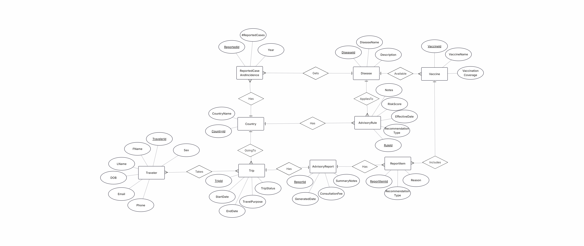

# Travel Vaccination Advisory System
> Designed and implemented a BCNF-normalized Oracle SQL database (10 entities, 11 FKs) 
> for a Travel Vaccination Clinic with ERD modeling, integrity constraints, DDL/DML, 
> and analytical SQL queries.

## Overview
A relational database system for a travel medicine clinic that centralizes traveler 
profiles, trip destinations, disease risks, and vaccine data to automate personalized 
health advisory report generation.

## Tech Stack

## Database Design
- **10 tables** | **11 foreign keys** | **BCNF normalized**
- Entities: Traveler, Trip, Country, Disease, Vaccine, AdvisoryRule, 
  ReportedCase, AdvisoryReport, ReportItem, TravelerOnTrip

## ER Diagram

### Schema (Post-BCNF)
| Table | Attributes | Keys |
|-------|-----------|------|
| COUNTRY | CID, CNAME | PK: CID |
| DISEASE | DID, DNAME, DESCRIP | PK: DID |
| TRAVELER | TRID, FNAME, LNAME, DOB, SEX, EMAIL, PHONE | PK: TRID |
| TRIP | TPID, STARTDATE, ENDDATE, TRIPSTATUS, TRAVELPURPOSE, CID | PK: TPID \| FK: CID |
| VACCINE | VID, VNAME, VCOVERAGE, DID | PK: VID \| FK: DID |
| AdvisoryRule | RID, RISKSCORE, RDATE, RTYPE, NOTES, CID, DID | PK: RID \| FK: CID, DID |
| RptedCase | RCID, RCDATE, CASES, SEVERITY, DID, CID | PK: RCID \| FK: DID, CID |
| AdvisoryRpt | ARID, SUMMARYNOTES, ARDATE, FEE, TPID | PK: ARID \| FK: TPID |
| TravelerOnTrip | TPID, TRID | PK: (TPID, TRID) \| FK: TPID, TRID |
| ReportItem | RIID, RITYPE, REASON, ARID, VID | PK: RIID \| FK: ARID, VID |

## SQL Highlights
| Query | Type |
|-------|------|
| Travelers & vaccines by destination | Inner Join |
| Trips without advisory reports | Outer Join |
| Diseases in both rules and case records | INTERSECT |
| Diseases not covered by any rule | MINUS |
| Total reported cases by country/disease | Aggregate |
| Countries with avg consultation fee > $75 | HAVING |
| Vaccines below average coverage | Subquery |

## Files
| File | Description |
|------|-------------|
| `ERD.png` | Entity-Relationship Diagram |
| `Travel Vaccination Advisory System.sql` | Full schema, data, and queries |
| `Travel Vaccination Advisory System_Report.pdf` | Full project documentation |
| `Travel Vaccination Advisory System_Result Screenshots.pdf` | Query result screenshots |
